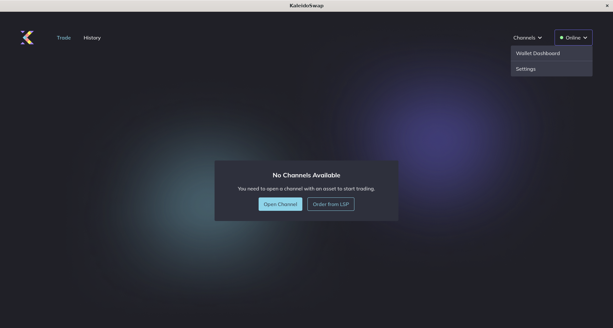
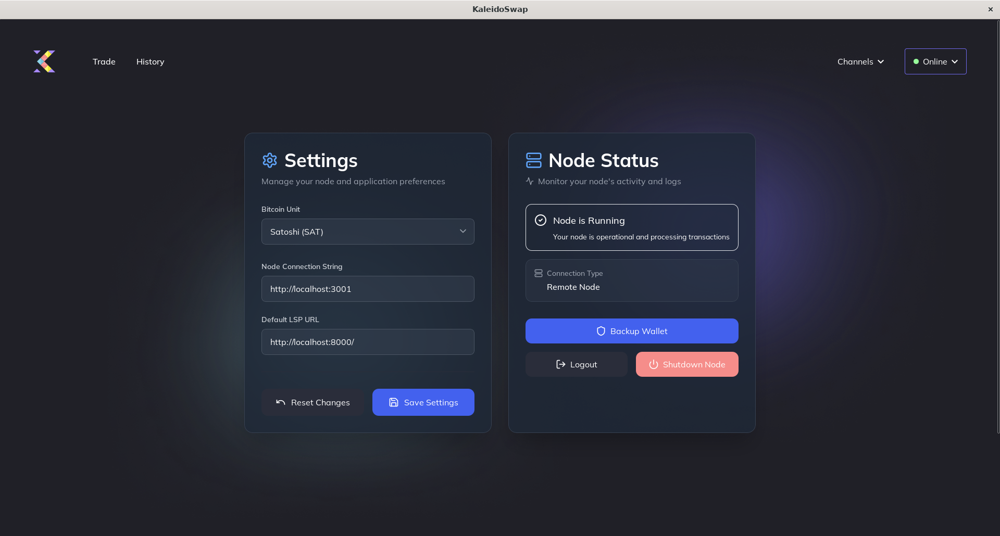
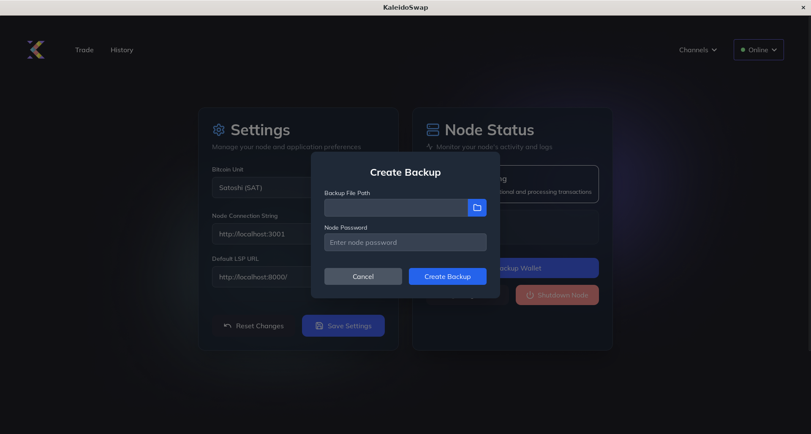

# Channel Backups

[← Back to Documentation](README.md)

Backing up your channels is essential to prevent loss of funds in case of device failure.

## Creating a Channel Backup

1. **Navigate to "Settings"**: Click the button in the upper right corner to bring up the drop-down menu. 
2. **Backup Option**: Click on "Backup Wallet". 
3. **Save Backup File**: Choose a secure location and input the node password. 
4. **Create Backup**: Create encrypted backup files with the node password in the selected destination clicking on "Create Backup".

---

*Next: [Channel Requests](ChannelRequests.md)*
