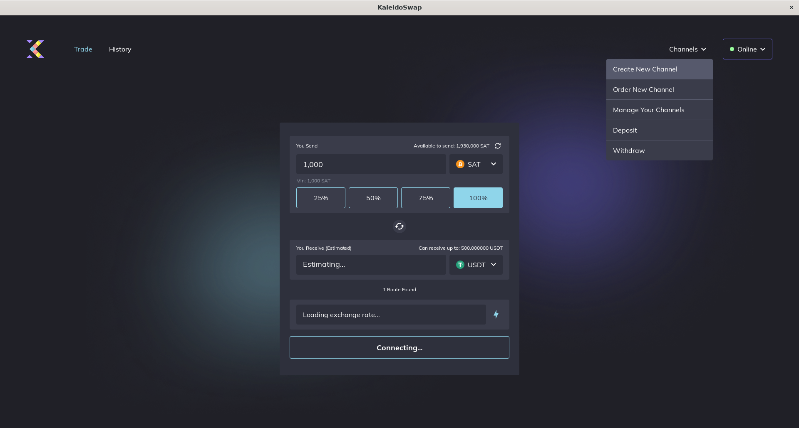
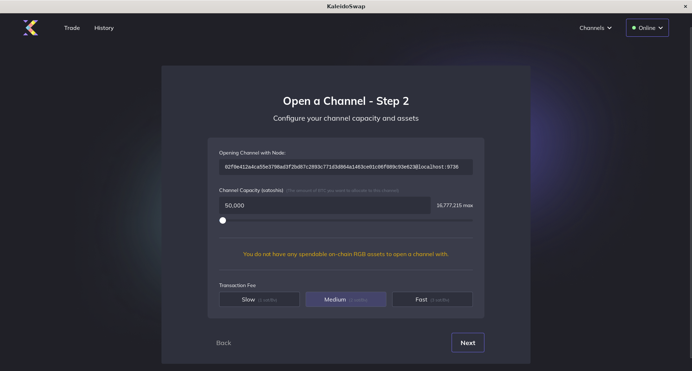

# Opening a New Channel Without Assets

[← Back to Opening a New Channel](OpeningChannel.md)

To open a Lightning Network channel without including RGB assets:

1. **Go to "Channels"**: Click on the "Channels" tab.
2. **Open New Channel**: Click "Create New Channel". 
3. **Enter Peer Information**: Input the node ID or public key of the peer. 
4. **Allocate Funds**: Specify the amount of Bitcoin to allocate to the channel. 
5. **Review Details**: Ensure all the information is correct.
6. **Open Channel**: Click "Next" to initiate the channel opening process.

---

*Next: [Channel Backups](ChannelBackups.md)*
