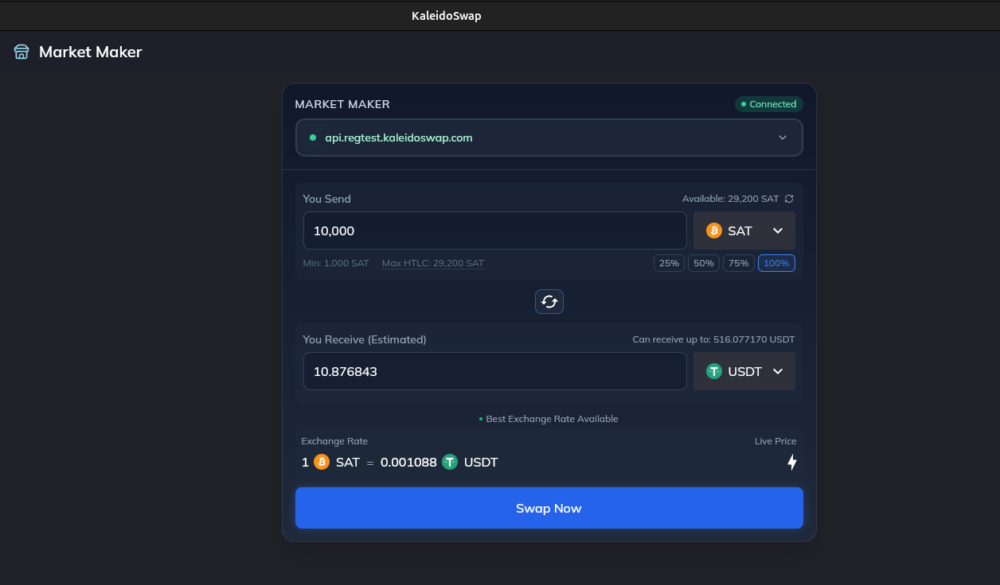
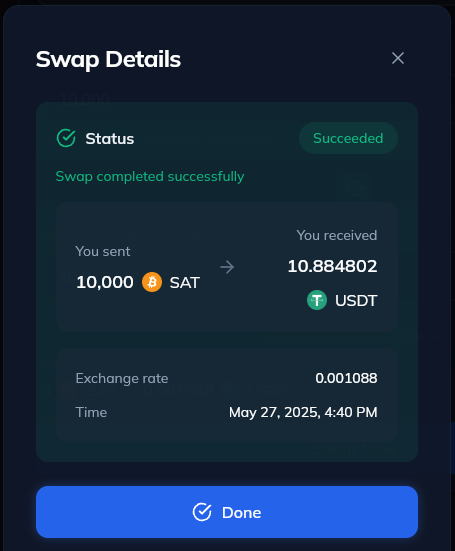
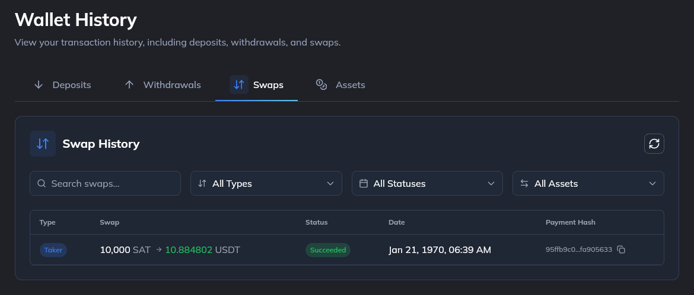

# Asset Swaps

[← Back to Documentation](./introduction.md)

Asset swaps allow you to exchange one RGB asset for another through the Kaleidoswap platform. Here's how to perform a swap:

## Performing an Asset Swap

1. **Navigate to "Trade"**: Click on the "Trade" tab in the left sidebar. Select the "Market Maker" option to start. 
2. **Select Assets**: Choose the asset you have and the asset you want to receive.
3. **Enter Amounts**: Specify the amount of the asset you wish to swap.

4. **Review Exchange Rate**: Check the current exchange rate and any fees.
5. **Confirm Swap**: Click "Swap" to execute the transaction.
6. **Transaction Confirmation**: Wait for the transaction to be confirmed on the network.

## Swap History

- **View Past Swaps**: In the "History" tab, you can view your swap history for record-keeping.

---

*Next: [Withdrawals](./withdrawals.md)*
