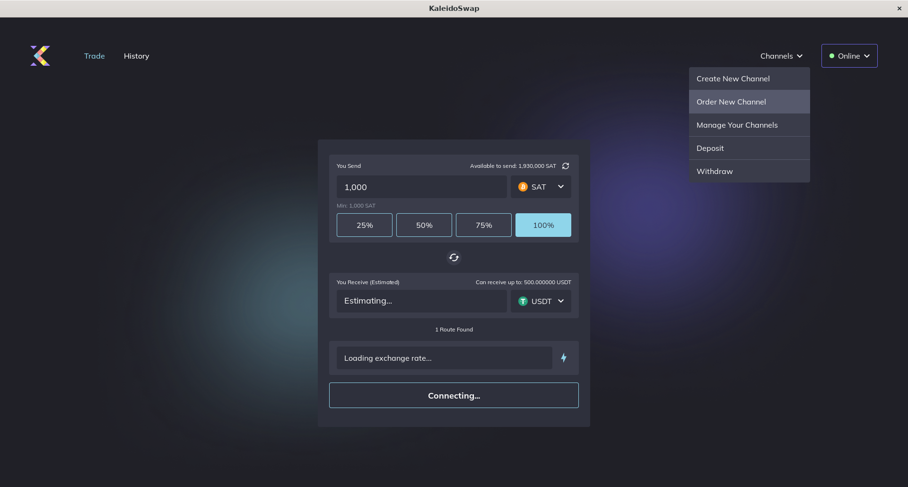
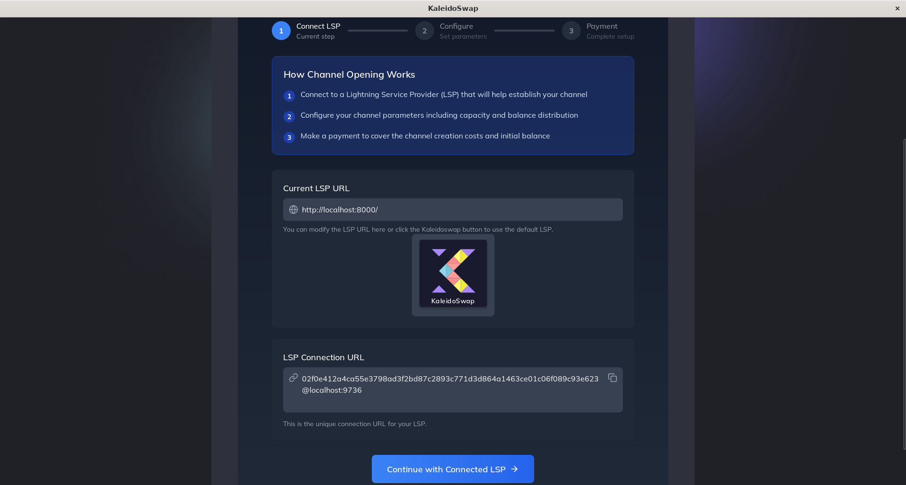
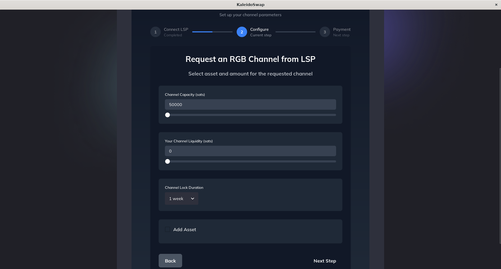
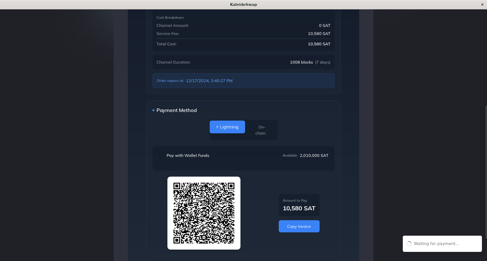
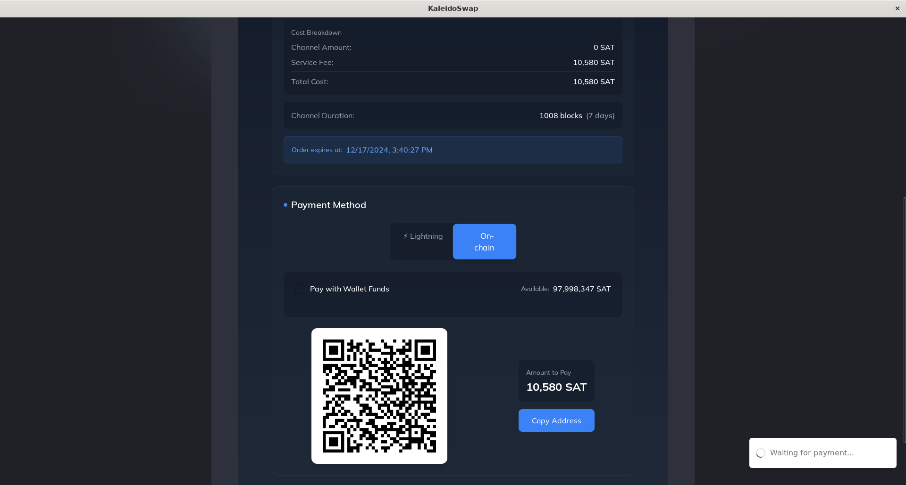

# Channel Requests

[← Back to Documentation](./introduction.md)

In addition to opening channels with other nodes, it is possible to request inbound channels from an LSP in exchange for a certain percentage of the liquidity held by your node:

1. **Go to "Channels"**: Click on the "Channels" tab.
2. **Request New Channel**: Click "Order New Channel". 
3. **Enter Peer Information**: Enter the URL of the LSP. 
4. **Allocate Funds**: Specify the required channel capacity, liquidity of your channel, duration, and possibly RGB assets to be added. 
5. **Review Details and Pay**: Make sure all information is correct and proceed with the payment required by the LSP via LN or onchain.  

---

*Next: [Asset Swaps](asset-swaps.md)*
