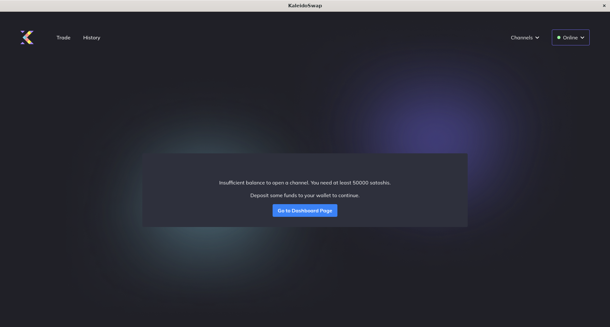
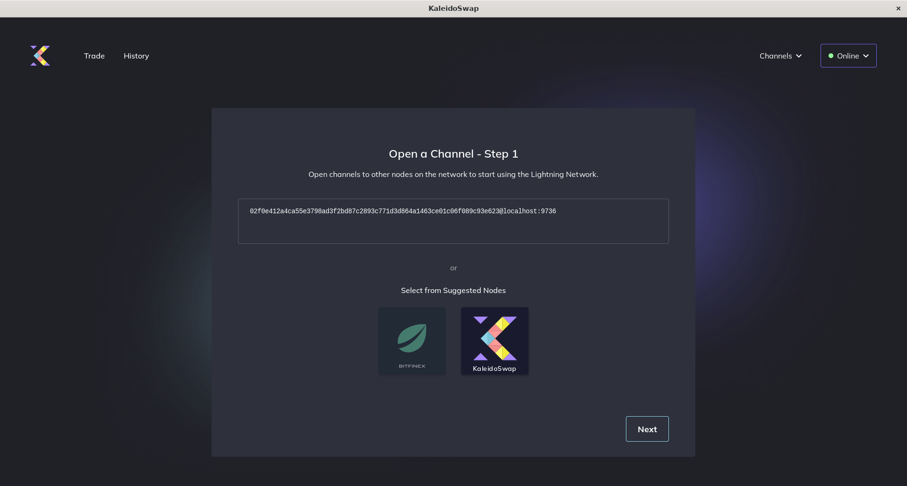

# Opening Channels

To use the Lightning network, you'll need to open channels. You can open channels with or without RGB assets, but you will need at least 50,000 SATs. 

## Opening a Basic Channel

To open a Lightning Network channel without RGB assets:

1. **Go to "Channels"**: Click on the "Channels" tab.
2. **Open New Channel**: Click "Create New Channel". 
3. **Enter Peer Information**: Input the node ID or public key of the peer. 
4. **Allocate Funds**: Specify the amount of Bitcoin to allocate to the channel. 
5. **Review Details**: Ensure all the information is correct.
6. **Open Channel**: Click "Next" to initiate the channel opening process.

## Opening a Channel With RGB Assets

To include RGB assets in your channel:

1. **Go to "Channels"**: Click on the "Channels" tab.
2. **Open New Channel**: Click "Open Channel".
3. **Enter Peer Information**: Input the node ID or public key of the peer.
4. **Allocate Bitcoin**: Specify the amount of Bitcoin for the channel.
5. **Add RGB Assets**: 
   - Click "Add Asset"
   - Select the RGB assets you want to include
   - Specify the amount for each asset
6. **Set Asset Allocation**: Define how much of each asset to allocate to the channel.
7. **Review Details**: Double-check all the information:
   - Bitcoin amount
   - RGB asset amounts
   - Peer information
8. **Open Channel**: Click "Confirm" to initiate the channel opening process.

## Channel Opening Process

1. **Confirmation**: The app will display a confirmation screen with the channel details.
2. **Funding Transaction**: The funding transaction will be broadcast to the Bitcoin network.
3. **Waiting Period**: Wait for the required number of confirmations (typically 3).
4. **Channel Active**: Once confirmed, your channel will be ready for use.

## Important Notes

- Minimum channel size: 50,000 SATs
- Required confirmations: 3 blocks
- Channel capacity cannot be changed after opening
- RGB assets can be added later through additional transactions
- Keep your node online during the opening process

---

*Next: [Channel Backups](channel-backups.md)*
