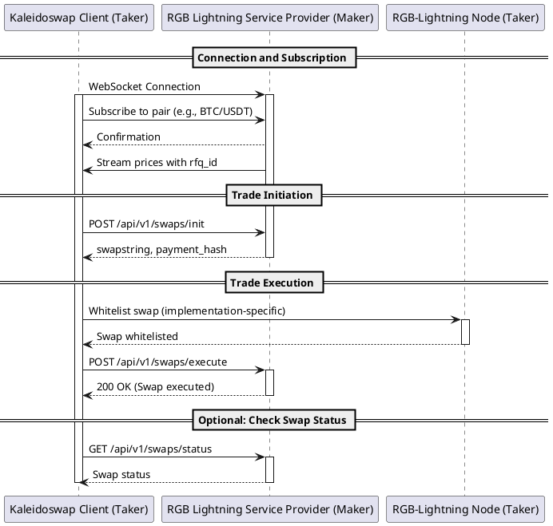

# RGB Lightning Swap Protocol - Integration Guide for Taker Clients

## Overview

This document provides an integration guide for developers aiming to integrate new clients as takers in the RGB Lightning Swap Protocol. The protocol facilitates the swap of RGB assets over the Lightning Network, enabling trades between a maker (the RGB Lightning Service Provider or a RLN node) and a taker.

## Table of Contents

1. [Protocol Description](#protocol-description)
2. [Sequence Diagram](#sequence-diagram)
3. [Taker Client Integration Steps](#taker-client-integration-steps)
4. [API Endpoints](#api-endpoints)
5. [Message Formats](#message-formats)

## Protocol Description

The protocol involves several steps to coordinate a trade between a maker and a taker:

1. **Connection**: The taker establishes a WebSocket connection to receive real-time price updates.
2. **Subscription**: The taker subscribes to specific asset pairs to receive streaming prices.
3. **Trade Initiation**: The taker initiates a trade by sending a swap request based on the received price updates.
4. **Trade Execution**: The taker executes the trade after receiving the necessary details from the maker.

## Sequence Diagram



## Taker Client Integration Steps

### Step 1: Establish WebSocket Connection

The taker client establishes a WebSocket connection to receive real-time price updates.

- **WebSocket URL**: 
  - Testnet: `wss://testnet.api.kaleidoswap.com/ws/{client_id}`
  - Mainnet: `wss://api.kaleidoswap.com/ws/{client_id}`

Replace `{client_id}` with a unique identifier for your client.

### Step 2: Subscribe to Asset Pair

The taker client subscribes to an asset pair to receive price streams.

- **Action**: Send a JSON message over the WebSocket
- **Data**: 
```json
{
  "action": "subscribe",
  "pair": "BTC/USDT"
}
```

### Step 3: Receive Price Stream

The maker streams prices to the taker client along with a request-for-quotation ID (rfq_id). The taker uses this ID in subsequent trade initiation requests.

### Step 4: Initiate Swap

To initiate a swap, the taker sends a POST request to the maker with the rfq_id and swap details.

- **Endpoint**: `/api/v1/swaps/init`
- **Method**: POST
- **Data**: 
  - `rfq_id`: The request-for-quotation ID from the price stream.
  - `from_asset`: The RGB asset ID to swap from.
  - `from_amount`: The amount of the asset to swap from.
  - `to_asset`: The RGB asset ID to swap to.
  - `to_amount`: The amount of the asset to swap to.

### Step 5: Receive Swap Details

Upon successful initiation, the maker responds with the swap details including a swap string and a payment hash.

### Step 6: Whitelist Trade

The taker whitelists the trade on their RGB-Lightning node. This step is implementation-specific and depends on the taker's node setup.

### Step 7: Execute Swap

The taker sends a POST request to the maker to execute the trade using the swap string.

- **Endpoint**: `/api/v1/swaps/execute`
- **Method**: POST
- **Data**: 
  - `swapstring`: The swap string received from the init step.
  - `taker_pubkey`: The public key of the taker.
  - `payment_hash`: The payment hash received from the init step.

### Step 8: Confirm Trade Execution

The maker confirms the trade execution and sends a response to the taker indicating the trade status.

### Step 9 (Optional): Check Swap Status

The taker can check the status of a swap at any time using the payment hash.

- **Endpoint**: `/api/v1/swaps/status`
- **Method**: GET
- **Query Parameter**: 
  - `payment_hash`: The payment hash of the swap.
